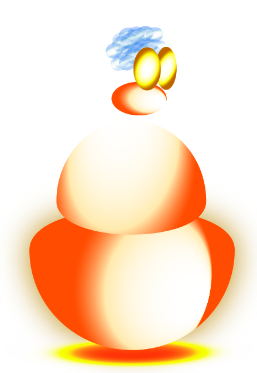

# Pi Reel

### Welcome to Pi Reel  
   
  Pi Reel is an easy to use animation tool, made for engineers, makers, and scientists of all skill levels. Pi Reel can create everything from animations, entrepreneurial videos, and animated structures and gizmos.  

  The Pi Reel Web application is more than a web application. Pi Reel is a school of thought. Our goal is to bring together an inclusive, welcoming group of science enthusiasts and professionals to accomplish through art and science a sustainable, safe, comfortable future for all. 

### Our Products and Services
  Let me introduce to you Fire Rolie, Pi Reel's chief archive director. His job is to make sure that all information in the archive is accurate and up to date. He also over see's the design of Pi Reel's universal viewer.  
  </img>
  

### Activism  
  Monopolization in industries like the energy industry have led to conflicts at the [South Dakota Pipelines](http://www.nbcnews.com/storyline/dakota-pipeline-protests/dakota-access-pipeline-now-has-oil-beneath-missouri-river-company-n739296), 
  rare earth metal conflicts in Africa, and more. Pi Reel puts the power in your hands to stop supporting conflicts here in the U.S. and overseas.  Technologies
  like Pi Reel gives you as a consumer more choices so that your not boxed in to small spaces.  
  
  These days web applications geared towards communications and graphics keep businesses local and at the same time connect them globally. Making for a diverse
  and dizzying array of potential uses for web programs. Pi Reel utilizes the best parts of the web so that users can make the best choices for them selves by being better informed. 

### Our Mission   
  We strive every day to bring a tolerant, compassionate, and just world to life by working in the open to collaborate on projects for science, engineering, and creating.  

  Pi Reel's mission statement speaks to the heart and life beat of the core animation web applicaiton. The core application otherwise known as the "Pi Reel Science and Engineering Animator" (PISEA) is built on top of a Cloud Server enabling people to share information instantly in animation, video, picture, right along instantly with related readable text information.  

  This by itself if not a solution though, but it is a step in the right direction we think though. We would love to know what you think and will be having an active conservation about it during the Mozilla Global Sprint. Please, check under projects "Mission Impossible Style" for more information.

### Our Beliefs and Values  
  Our belief is that through art we can overcome obstacles and come together to learn and share our knowledge and dreams to create a better world.    

### Resources and the Manual  
  Our manual can be downloaded via, [Google Docs](https://docs.google.com/document/d/1JhZSIDOWfNYXMOPRvt6WDSX6lsT_1ktprTT3yyg4iDo/edit?usp=sharing).  

### Contributing   
  Thanks for your interest in contributing to Pi Reel! There are many ways to contribute. To get started, take a look at CONTRIBUTING.md.  

### Participation Guidelines  
  This projects code of conduct can be found at the following link,  
  [Mozilla Community Participation Guidelines](https://www.mozilla.org/en-US/about/governance/policies/participation/).  
  
  Some resources to help you become the best participator you can be:  
  1. [Open Canvas](https://mozilla.github.io/open-leadership-training-series/articles/opening-your-project/develop-an-open-project-strategy-with-open-canvas/#introducing-open-canvas)  
  2. [Mark Down](https://guides.github.com/features/mastering-markdown/): Learn the "md" file extension syntax. 
  
  Please report unacceptable behavior to kipomaha@gmail.com.  

